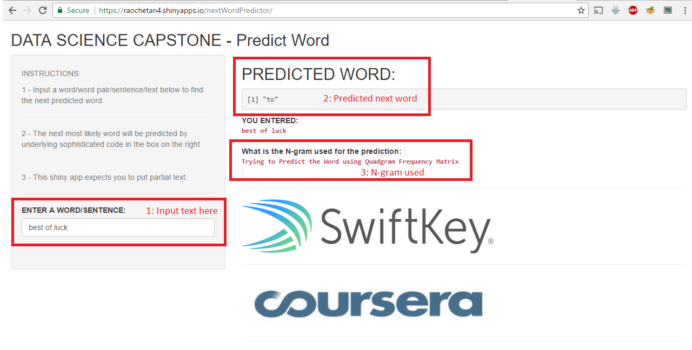

WordPredictor
========================================================
author: Chetan Rao
date: May 15 2017
autosize: true

First Slide
========================================================

The goal of this capstone project was to showcase the knowledge gained in the nine crucial courses of Data Sciences. I personally learnt a lot from this exercise even though it took me quite some time to finish this I am eager to learn and apply more techniques of data sciences.

The capstone mainly focussed on NLP (Natural Language Processing) as seen in the Swift Key App. The goal of this slide deck is to give a quick tour of Shiny App created for Capstone project
<https://raochetan4.shinyapps.io/nextWordPredictor/>.
Please check it out and give any feedback:
This app predicts the next word as the user types a sentence. The data from which the model learnt was around 80% of the provided data with some additional google texts which helped in Quizes.

How to Use the SHINY APP
========================================================

Getting and Cleaning the data
========================================================

- Used almost 80% of the data from blogs/twitter/news datasets provided.
- Removed profane words <https://en.wikipedia.org/wiki/Profanity>
- Due to the nature of the project had to do the data processing piece-wise. So split the data in 4 equal parts and then eventually merged the data to generate the n-grams
- RData files are stored in RDS format.

Algorithm for prediction of the next word
========================================================

- N-gram model with "Stupid Backoff" ([Brants et al 2007](http://www.cs.columbia.edu/~smaskey/CS6998-0412/supportmaterial/langmodel_mapreduce.pdf))
- Checks if the highest-order (for the app I created uses n=5 pentgrams) has been seen. If not goes down to n-1 gram and so on.
- Due to time limitations and my first attempt to handle such a huge data set I added more data to achieve good results.

Further Exploration
========================================================

- The code is available on [GitHub](https://github.com/raochetan4/capstoneProject.git)
- Further work:
    1. Add more KN smoothing and laplace smoothing. Logarithmic probabilities may be used.
    2. Also compare the N-grams using the google huge data sets
    3. Contextual details from previous sentences or close by words to predict the next word.
    4. Can be tried on different languages
